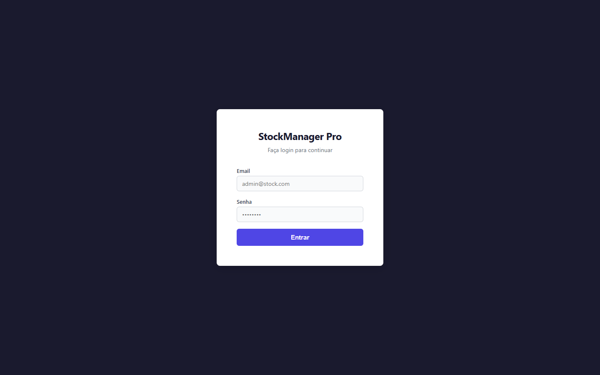
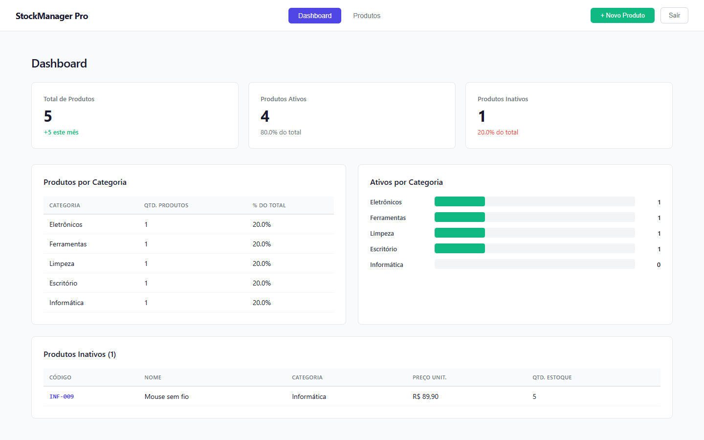
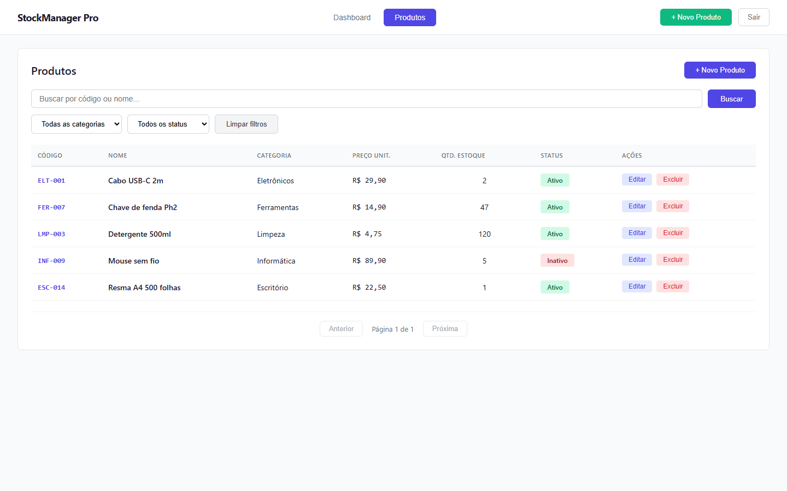
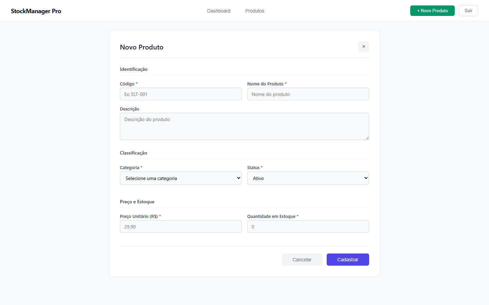

# StockManager Pro

[](backend/api/pom.xml)
[](backend/api/pom.xml)
[](frontend/package.json)
[](script.sql)
[](LICENSE)

[🇧🇷 Ler em português](README.pt-BR.md)

Full-stack inventory management application with authentication, dashboard analytics, and complete CRUD — built with Spring Boot and React.

## Screenshots

| Login | Dashboard |
|---|---|
|  |  |

| Product list | Product form |
|---|---|
|  |  |

## Stack

- **Backend**: Java 17, Spring Boot 3.5, Spring Data JPA, Spring Security, MySQL 8
- **Frontend**: React 18, Axios
- **Database**: MySQL 8

## Features

- Email/password authentication (HTTP Basic) against the backend
- Dashboard with total products, active/inactive breakdown with percentages, products per category, and a list of inactive products
- Product listing with text search plus category/status filters
- Full CRUD for products (name, code, description, category, status, unit price, stock quantity)
- Automated tests on both backend (JUnit) and frontend (React Testing Library)

## Prerequisites

- Java 17+
- Node.js 18+ and npm
- MySQL 8 running locally
- Maven does not need to be installed separately — the project ships with the wrapper (`mvnw`)

## Database setup

1. Run the `script.sql` script (at the project root) in a MySQL client. It creates the `stockmanager` database, the `produtos` table, and seeds 5 sample products (one per category).
2. Create a dedicated application user:

```sql
CREATE USER 'stockmanager'@'localhost' IDENTIFIED BY 'Stock@Manager123!';
GRANT ALL PRIVILEGES ON stockmanager.* TO 'stockmanager'@'localhost';
FLUSH PRIVILEGES;
```

To use a different user/password, override them via the `DB_USERNAME` and `DB_PASSWORD` environment variables — `application.properties` already reads from them.

## Running the backend

```bash
cd backend/api
./mvnw spring-boot:run
```

Starts on `http://localhost:8080`.

Run automated tests:

```bash
./mvnw test
```

## Running the frontend

```bash
cd frontend
npm install
npm start
```

Opens on `http://localhost:3000`.

Run automated tests:

```bash
npm test -- --watchAll=false
```

## Demo login

| Field | Value |
|---|---|
| Email | `admin@stock.com` |
| Password | `admin123` |

> Demo credentials seeded by `script.sql` — local development only.

## API

Base URL: `http://localhost:8080/api`. All endpoints (except login) require HTTP Basic Auth.

| Method | Route | Description |
|---|---|---|
| POST | `/auth/login` | Authenticates `{ "email", "senha" }` |
| GET | `/produtos` | Lists products; accepts optional, combinable `termo`, `categoria`, `status` |
| GET | `/produtos/{id}` | Fetches a product by ID |
| GET | `/produtos/codigo/{codigo}` | Fetches a product by code |
| POST | `/produtos` | Creates a product |
| PUT | `/produtos/{id}` | Updates a product |
| DELETE | `/produtos/{id}` | Deletes a product |
| GET | `/produtos/dashboard` | Dashboard metrics |
| GET | `/produtos/categorias` | Lists the 5 fixed categories |

A ready-to-import **Insomnia** collection is available at `insomnia_stockmanager.json` (project root).

## Project structure

```
backend/api/src/main/java/com/stockmanager/
├── config/         # SecurityConfig (auth, CORS)
├── controller/      # AuthController, ProdutoController
├── dto/             # ProdutoDTO, DashboardDTO
├── exception/       # GlobalExceptionHandler
├── model/           # Produto (JPA entity)
├── repository/      # ProdutoRepository
└── service/         # ProdutoService (business rules)

frontend/src/
├── api/             # axios client
└── components/      # Login, Dashboard, ProdutosList, ProdutoForm, Navbar
```

## License

Distributed under the MIT License. See [LICENSE](LICENSE).
